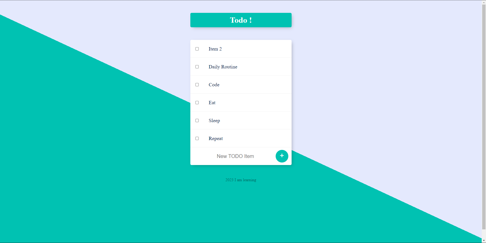

# TODO Web App

This is a simple web application built using Node.js and MongoDB to manage TODO lists. It allows users to create, update, and delete tasks, as well as organize them into different lists.

## Features

- User-friendly interface: The web app provides a responsive and intuitive user interface for managing tasks and lists.
- Multiple lists: Users can create and switch between different lists to organize their tasks based on different categories or projects.
- Add and remove tasks: Users can easily add new tasks to their lists and mark tasks as completed or delete them when necessary.
- Persistence: Tasks and lists are stored in a MongoDB database, ensuring that user data is preserved even after restarting the application.

## Installation

1. Clone the repository: `git clone <repository_url>`
2. Navigate to the project directory: `cd todo-web-app`
3. Install the dependencies: `npm install`

## Configuration

1. Rename the `.env.example` file to `.env`.
2. Open the `.env` file and set the appropriate values for your MongoDB connection.

## Usage

1. Start the application: `npm start`
2. Open a web browser and visit `http://localhost:3000`
3. You will be presented with the default TODO list.
4. To create a new list, enter the list name in the input field and press the "Create" button.
5. To add a task to the list, enter the task description in the input field and press the "Add" button.
6. To mark a task as completed, check the corresponding checkbox.
7. To delete a task, click on the delete button next to the task.
8. To switch between lists, click on the list name in the navigation bar.

## Dependencies

- Express: Web application framework for Node.js
- Body-parser: Middleware to parse incoming request bodies
- Mongoose: MongoDB object modeling tool
- EJS: Templating engine for rendering dynamic HTML pages

## Contributing

Contributions are welcome! If you find any issues or have suggestions for improvements, please open an issue or submit a pull request.

## Screenshot

